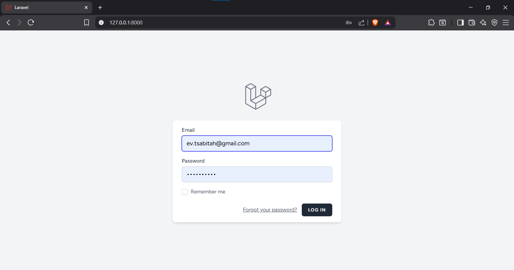
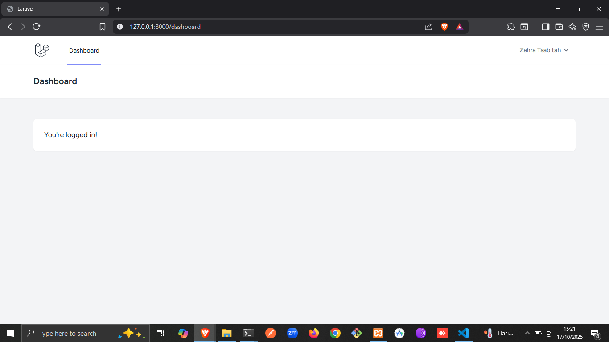

# Pertemuan 4 - Autentikasi

Pada pertemuan ini, kita telah berhasil menambahkan sistem autentikasi yang lengkap dan
aman ke dalam aplikasi "LaraPress". Kita tidak hanya belajar cara menginstal Laravel Breeze,
tetapi juga memahami konsep fundamental di baliknya. Kini aplikasi kita siap untuk fitur
selanjutnya: Otorisasi, di mana kita akan mengatur hak akses spesifik untuk setiap pengguna.

## Identitas Diri

-   **Nama : Zahra Tsabitah**
-   **NPM : 4523210145**

## Deskripsi

Bagian 2: Langkah-Langkah Praktikum

1. Buka Terminal: Masuk ke direktori proyek LaraPress Anda.
2. Instalasi Breeze via Composer: Perintah ini akan mengunduh paket Breeze dan
   dependensinya.
3. Jalankan Perintah Instalasi Breeze: Perintah ini akan mempublikasikan semua file
   yang dibutuhkan (Controllers, Views, Routes) ke dalam aplikasi Anda.
4. Instalasi Dependensi Frontend: Breeze menggunakan Tailwind CSS. Perintah ini akan
   menginstal dependensi JavaScript dari file package.json.
5. Kompilasi Aset: Perintah ini akan meng-compile file CSS dan JS agar bisa digunakan
   oleh browser.
6. Jalankan Migrasi: Breeze perlu menambahkan kolom remember_token ke tabel users
   dan membuat tabel password_reset_tokens.
7. Uji Coba: Jalankan server Anda (php artisan serve). Buka aplikasi di browser. Anda
   sekarang akan melihat link "Log in" dan "Register" di pojok kanan atas. Coba buat
   akun baru dan login!

## Hasil Praktikum Tampilan Aplikasi

### Tampilan Halaman Login

### Tampilan Setelah Login

Masih memakai default dari template Brezee dimana setelah login maka akan otomatis redirect ke halaman dashboard bawaan. Belum disesuaikan kembali.
