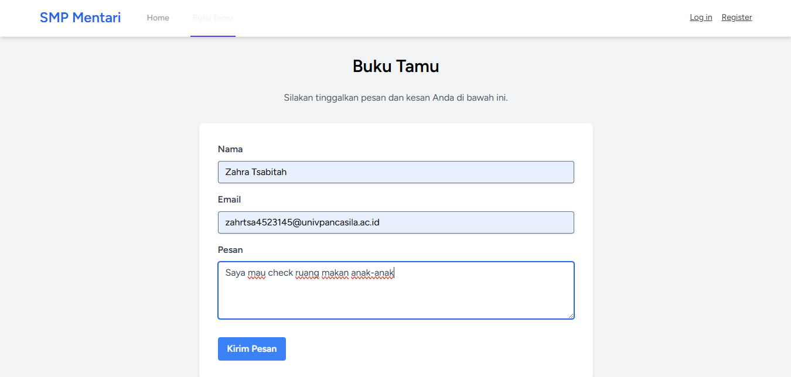
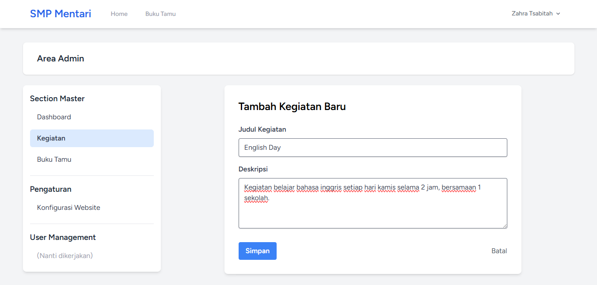

# Pertemuan 5 - Membuat Website SMP Mentari Ceria
Website SMP Mentari Ceria adalah aplikasi web sederhana yang dibangun dengan Laravel 12 untuk menampilkan informasi dan kegiatan sekolah. Aplikasi ini dilengkapi dengan fitur buku tamu digital yang memungkinkan pengunjung meninggalkan pesan dan kesan mereka.

## Identitas Diri
- **Nama : Zahra Tsabitah**
- **NPM  : 4523210145**

## Fitur Utama:
- ✅ Tampilan Kegiatan Sekolah - Showcase kegiatan terbaru dengan card design
- ✅ Buku Tamu Digital - Pengunjung dapat meninggalkan pesan
- ✅ Form Validasi - Validasi input untuk nama, email, dan pesan
- ✅ Real-time Feedback - Notifikasi sukses/error setelah submit
- ✅ Responsive Design - Tampilan optimal di semua device
- ✅ Timestamp Relatif - Menampilkan waktu pesan (e.g., "2 jam yang lalu")
- ✅ Modern UI/UX - Desain clean dengan Tailwind CSS
 
## Tampilan Aplikasi [Feat]:Buku Tamu Digital

Tampilan Formulir Buku Tamu

Tampilan Hasil Buku Tamu

## Tampilan Aplikasi [Feat]:Kegiatan

Tampilan Formulir Kegiatan [Create]

Tampilan Hasil Kegiatan [Read]

Tampilan Formulir Edit Kegiatan [Update]

Tampilan Hasil Hapus Kegiatan [Delete]
